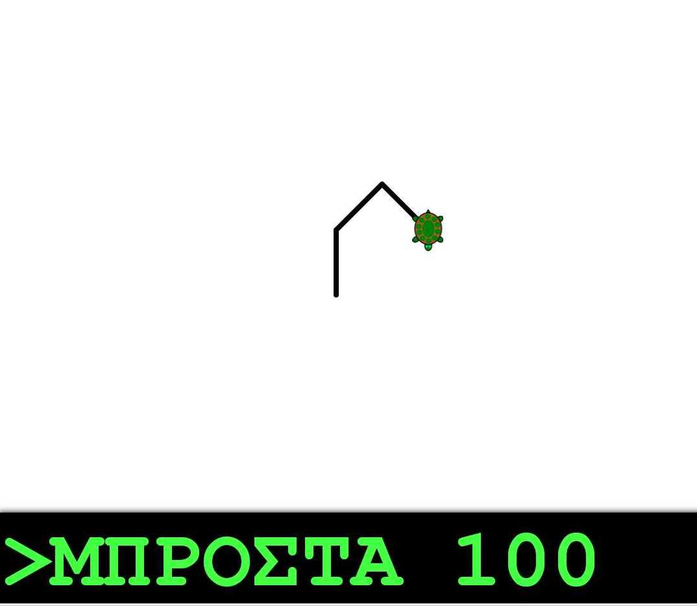

# jsturtlegraphics2013 / tortuga-kids-gr
jsturtlegraphics20130419 got from sourceforge.
ΑΠΛΗ ΕΚΔΟΣΗ ΤΗΣ logo ΓΙΑ ΜΙΚΡΑ ΠΑΙΔΙΑ Η' ΆΤΟΜΑ ΜΕ ΠΡΟΒΛΗΜΑΤΑ ΌΡΑΣΗΣ!
(ΔΟΚΙΜΑΣΤΙΚΟ ΛΙΝΚ (dev) : http://gamesedu.github.io/tortuga-kids-logo-gr/index.html

It has very big fonts and graphics. Can be used for people with sight problems or very younh pupils.

ΑΡΧΙΚΗ ΕΚΔΟΣΗ:
All the code covered by the <a href="http://www.gnu.org/licenses/gpl.html">GPLv3 license</a>.  
Developed by John Villar.  
Twitter: <a href="http://twitter.com/johnvillarz">@johnvillarz</a> 
E-mail: johnvillarzavatti [at] gmail [dot] com 
